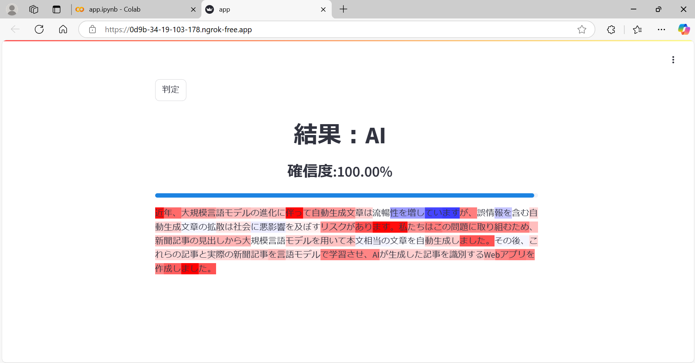

## 真贋判定アプリ（Authenticity-check）

新聞記事を見て、人間が書いた記事かAIが書いた記事かを自動で判定するWebアプリです。

## 概要


近年、大規模言語モデルの進化に伴って自動生成文章は流暢性を増していますが、誤情報を含む自動生成文章の拡散は社会に悪影響を及ぼすリスクがあります。私たちはこの問題に取り組むため、新聞記事の見出しから大規模言語モデルを用いて本文相当の文章を自動生成しました。その後、これらの記事と実際の新聞記事を言語モデルで学習させ、AIが生成した記事を識別するWebアプリを作成しました。

## 機能説明

・ txtファイルのアップロード、テキストの記入が可能<br>
・ 「判定」ボタンを押すと判定を開始（CPUを使用するため約5分かかります）<br>
・ 判定が終了すると、判定結果、確信度が表示されます。<br>
・ また、判定を行った文章が表示され、判断結果の根拠となる部分がハイライト表示されます。

## Webアプリのデモ

Webアプリを立ち上げた時の画面


真贋判定を行った結果の画面


## 使用技術

|Category|Tecknology Stack|
|:-|:-|
|Frontend|Python, Streamlit, Flask|
|Backend|Python, RoBRTa, LIME|

## 使用方法

１．プロジェクトのインストール<br>
２．仮想環境の構築<br>
３．依存関係のインストール<br>

### １．プロジェクトのインストール
以下の手順でプロジェクトをローカル環境にインストールしてください。

```
ディレクトリを作成し移動
mkdir repository
cd repository

リポジトリをクローン
git clone https://github.com/j329nish/Authenticity-check.git
```

### ２．仮想環境の構築
以下の手順で仮想環境を作成してください。（※Python、Gitがインストールされていること前提です。）
```
Pythonはこれを参考にインストールしてください。
https://www.python.jp/install/windows/install.html

Gitは以下からインストールしてください。
https://qiita.com/T-H9703EnAc/items/4fbe6593d42f9a844b1c
```

```
cmdを起動し、GitHubからpyenvをインストール
git clone https://github.com/pyenv-win/pyenv-win.git "%USERPROFILE%\.pyenv"
```

Windowsキーを押して「環境変数」と入力し、「システム環境変数の編集」を開く。
<br>
<br>

<br>
「環境変数」を押す。
<br>


<br>
システム環境変数のPathを押して「編集」を押す。
<br>


<br>
新規で以下2つを追加する。

```
%USERPROFILE%\.pyenv\pyenv-win\bin
%USERPROFILE%\.pyenv\pyenv-win\shims
```

<br>
作成したディレクトリでcmdを起動し、仮想環境を構築する。

```
pythonの古いバージョンをインストール
pyenv install 3.10.6
pyenv local 3.10.6

仮想環境を構築
python -m venv pytorch-env
```

<br>
以下のようにコマンド操作ができたら完了です。

```
仮想環境の起動
.\pytorch-env\Scripts\activate

仮想環境の終了
deactivate
```

### ３．依存関係のインストール
アプリのあるディレクトリで仮想環境を起動した後、以下の手順で依存関係をインストールしてください。

```
pip install torch torchvision torchaudio
pip install pytorch-lightning
pip install streamlit
pip install plotly
pip install transformers
pip install lime
pip install shap
```

```
※もし以下のようなエラーが出たら
Importing the numpy C-extensions failed. This error can happen for
many reasons, often due to issues with your setup or how NumPy was
installed.

このようにnumpyをインストールし直してください。
pip uninstall numpy
pip install numpy
```

```
※もし以下のようなエラーが出たら
ImportError: cannot import name '_imaging' from 'PIL'

このようにPillowをインストールし直してください。
pip uninstall Pillow
pip install Pillow
```

```
※もし以下のようなエラーが出たら
import pandas._libs.pandas_parser  # isort: skip # type: ignore[reportUnusedImport]
ModuleNotFoundError: No module named 'pandas._libs.pandas_parser'

このようにpandasをインストールし直してください。
pip uninstall pandas
pip install pandas
```

## 使い方

アプリのあるディレクトリに移動した後、以下のように実行してください。
```
.\pytorch-env\Scripts\activate
streamlit run app.py
```

## （作成者向け）GitHubの使い方

GitHubとは、ソースコードの管理や共同作業を行うためのウェブプラットフォームです。成果物の管理を共有でき、チーム開発がしやすいため、多くのITエンジニアに重宝されています。
GitHubは以下のような形で構成されてます。


### リポジトリとmainブランチの作成

### 2つ目以降のブランチの作成

### 外部アカウントでのリポジトリへの参加

### ファイルの更新と削除（ローカルからリモート）

### ファイルの更新と削除（リモートからローカル）

### vimの使い方

### ブランチでの統合作業

### コンフリクトへの対応

## ライセンス

このプロジェクトは...ライセンスのもとで公開されています。

## クレジット

作成者：<br>
西田：https://github.com/j329nish<br>
濱本：https://github.com/j348hama<br>
松浦：https://github.com/j396mats<br>

